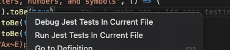

# VS Code Jest Debug Configuration Extension

This extension provides advanced Jest debugging configuration capabilities for VS Code. It allows you to specify different Jest configurations for different test files using pattern matching.

## Features

- Automatically configures Jest debugging sessions
- Supports multiple Jest configurations through pattern matching
- Runs tests in debug mode with proper source maps
- Context menu integration for test files:
  - **Run Jest Tests In Current File**: Runs the tests in the current file using your Jest configuration
  - **Debug Jest Tests In Current File**: Starts a debugging session for tests in the current file

## Usage

### Context Menu Options

When you right-click on a test file (files matching `*.test.ts`, `*.spec.ts`, etc.), you'll see two options:



1. **Run Jest Tests In Current File**

   - Executes the tests without attaching the debugger
   - Uses your Jest configuration from launch.json
   - Shows test output in an integrated terminal

2. **Debug Jest Tests In Current File**

   - Starts a debugging session for the tests
   - Allows setting breakpoints and stepping through code
   - Uses your Jest configuration from launch.json

If you have multiple Jest configurations in your launch.json, the extension will prompt you to choose which configuration to use.

## Configuration

The extension supports both global configuration and pattern-based configuration through the launch.json file. Here's a detailed breakdown of the configuration options:

### Required Configuration Fields

To mark a launch configuration for Jest debugging, you must include:

- `isJestDebugConfig`: Set to `true` to indicate this configuration should be handled by the Jest debugger
- `defaultJestConfigPath` (required): Default path to the Jest configuration file when no pattern matches are found
- `defaultCwd` (required): Default working directory for Jest when no pattern matches are found

### Pattern-Based Configuration (`jestConfigMap`)

The `jestConfigMap` array allows you to specify different Jest configurations based on file patterns. Each entry contains:

- `pattern` (required): A regular expression pattern to match against test file paths
- `config` (required): Path to the Jest configuration file for matching tests
- `cwd` (optional): Working directory for Jest when running matching tests

### Example VSC launch.json Configuration

```json
{
  "version": "0.2.0",
  "configurations": [
    {
      "type": "node",
      "request": "launch",
      "name": "Jest: current file",
      "isJestDebugConfig": true,
      "console": "integratedTerminal",
      "args": ["--runInBand"],
      "defaultJestConfigPath": "${workspaceFolder}/src/jest.config.js",
      "defaultCwd": "${workspaceFolder}/src",
      "jestConfigMap": [
        {
          "pattern": ".*packages\\/my-client\\/.*\\.tests?\\.ts",
          "config": "${workspaceFolder}/packages/my-client/jest.config.js",
          "cwd": "${workspaceFolder}/packages/my-client"
        },
        {
          "pattern": ".*packages\\/classifiers\\/.*\\.tests?\\.ts",
          "config": "${workspaceFolder}/packages/classifiers/jest.config.js",
          "cwd": "${workspaceFolder}/packages/classifiers"
        },
        {
          "pattern": ".*packages\\/amazing-engine\\/.*\\.tests?\\.ts",
          "config": "${workspaceFolder}/packages/amazing-engine/jest.config.js",
          "cwd": "${workspaceFolder}/packages/amazing-engine"
        },
        // These match in order of precedence here, i.e. integration tests in the awesome-tool directory will match here..
        {
          "pattern": ".*packages\\/awesome-tool\\/.*\\.tests?\\.integration\\.ts",
          "config": "${workspaceFolder}/packages/awesome-tool/jest.config.integration.js",
          "cwd": "${workspaceFolder}/packages/awesome-tool"
        },
        // .. and other integration tests will match here
        {
          "pattern": ".*\\.tests?\\.integration\\.ts",
          "config": "${workspaceFolder}/src/jest.config.integration.js",
          "cwd": "${workspaceFolder}/src"
        },
        {
          "pattern": ".*\\.tests?\\.repo\\.ts",
          "config": "${workspaceFolder}/src/jest.config.repo.js",
          "cwd": "${workspaceFolder}/src"
        },
        {
          "pattern": ".*\\.tests?\\.snapshot\\.ts",
          "config": "${workspaceFolder}/src/jest.config.snapshots.js",
          "cwd": "${workspaceFolder}/src"
        }
      ]
    },
    {
      "type": "node",
      "request": "launch",
      "name": "Other Node.js Debug Config"
      // This configuration will not be affected by the Jest debugger
      // since isJestDebugConfig is not set to true
    }
  ]
}
```

### Pattern Matching

The `pattern` field in `jestConfigMap` entries uses regular expressions to match test file paths. Some examples:

- `.*\\.test\\.ts$`: Matches files ending with .test.ts
- `.*\\.spec\\.ts$`: Matches files ending with .spec.ts
- `.*__tests__.*\\.ts$`: Matches TypeScript files in **tests** directories

### Best Practices

1. Order your patterns from most specific to least specific
2. Use absolute paths with `${workspaceFolder}` for reliability
3. Include the `cwd` field when tests require specific working directory context
4. Use `--runInBand` for predictable debugging sessions

## Installation

Build with `npm compile` and run `vsce package` to create a vsix file. In the VSC/Cursor command palette find `Extensions: Install from vsix...` and install the file created by `vsce package`.

## Requirements

- VS Code 1.80.0 or higher
- Node.js 16.x or higher
- Jest installed in your project

## Known Issues

- None at the moment
